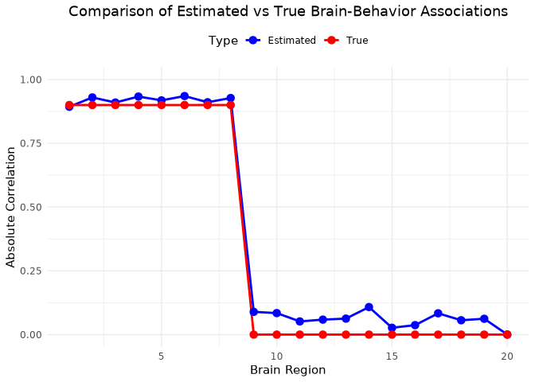
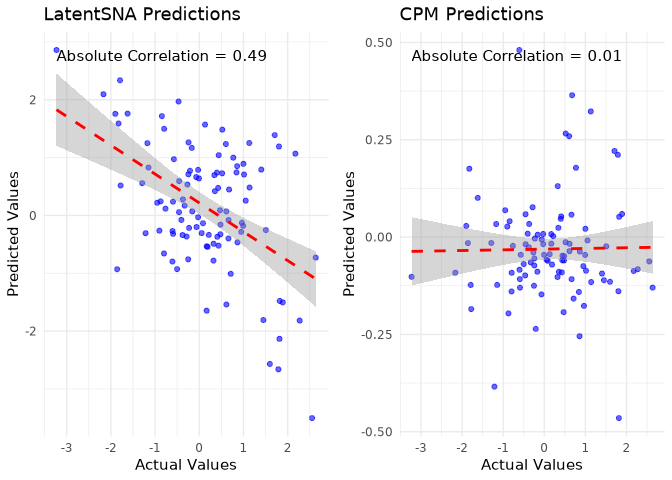

# LatentSNA tutorial
## Overview


The LatentSNA model is specifically designed for identifying imaging biomarkers using brain connectivity data. It offers robust tools for unbiased estimation of imaging biomarkers' influence on behavior variants, quantification of the uncertainty and evaluation of the likelihood of the estimated biomarker effects against chance, brain-behavior prediction in novel samples for both connectivity and behaviors.


## Installation

This toolkit is implemented in R. Follow these steps for setup:


1. Clone or download the repository to your local machine.
2. Open R and navigate to the directory containing the toolkit.
3. Run the latentSNA model.


## Required Data


The toolkit is designed to analyze data consisting of brain connectivity and individual outcomes. Specifically, it requires two key files:

* `X`: a list of $V \times V$ brain connectivity data.
* `Y`: a matrix of $N \times P$ individual outcome data.

Additionally, simulated example data is available in the directory `data/X.RData` and `data/Y.RData` for demonstration purposes.


## Key parameters

* `W` a matrix of $N \times Q$ covariates for the connectivity data.
* `H` a matrix of $N \times Q1$ covariates for the attribute data.
* `nscan` number of iterations of the Markov chain (beyond burn-in)
* `burn` burn-in for the Markov chain

Note that sufficient burn-in is need to reach optimal covariance parameter estimates. See details in the method paper. 

## Usage


The main functionality of the LatentSNA Toolkit is encapsulated in the `latentSNA.r` script, which performs MCMC estimation of each of the unknown quantities. Toy Example data are in the `data` folder. The `latentSNA.r` can do the following connectivity data analysis:

### Run LatentSNA model

```{r s1, eval=FALSE}
library(latentSNA)

setwd("/Users/selena/Desktop/github/LatentSNA/data")

load(file='X.rda')
load(file='Y.rda')


model1=latentSNA(X, Y,W=NULL, H=NULL,
                   seed = 1, nscan = 10, burn = 1, odens = 1,
                   prior=list())

```


### Obtain unbiased estimates of covariance parameters.

From the saved model results, we can obtain estimated $N \times V$ brain latent connectivity as `model1$UPM`, posterior samples of the covariance parameters can be obtained via `model1$COV`, etc. See details in the pacakge documentation. 

LatentSNA Simulation Example
================

## Introduction

This is a simulation study using the LatentSNA package to analyze brain
connectivity data and behavioral outcomes. The simulation includes data
generation, model fitting, and result visualization. The goal is to
demonstrate how latent space models can be used to analyze the
relationship between brain connectivity patterns and behavioral
outcomes.

## Load prerequisite packages

``` r
library(MASS)
library(psych)
library(coda)
library(magic)
```

    ## Loading required package: abind

## Source LatentSNA code

We first define a helper function to source all R files from the
LatentSNA package directory. This function will load all the necessary
functions for our analysis.

``` r
#set seed and load the latentSNA code
set.seed(18)

sourceEntireFolder <- function(folderName, verbose=FALSE, showWarnings=TRUE) {
  files <- list.files(folderName, full.names=TRUE)
  
  # Grab only R files
  files <- files[ grepl("\\.[rR]$", files) ]
  
  if (!length(files) && showWarnings)
    warning("No R files in ", folderName)
  
  for (f in files) {
    if (verbose)
      cat("sourcing: ", f, "\n")
    ## TODO:  add caught whether error or not and return that
    try(source(f, local=FALSE, echo=FALSE), silent=!verbose)
  }
  return(invisible(NULL))
}

sourceEntireFolder("/gpfs/gibbs/pi/zhao_yize/xz634/latentSNA-main/R", verbose=FALSE, showWarnings=TRUE) 
```

## Generate Simulated Data

In this section, we generate simulated data that mimics brain
connectivity patterns and behavioral outcomes. We set up:

- A sample of 1000 subjects
- 20 brain regions
- 5 significant brain regions with strong correlations (0.9)
- A single behavioral outcome
- One-dimensional latent space

First, we set up basic parameters:

``` r
N<-1000 #N is sample size
ids=seq(1,N)

V<-20 # V is number of brain regions
P<-1 # P is number of behaviors

K<-1 # K and D are latent space
D<-1

W<-NULL# W and H are covariates
H<-NULL
```

Next, we create the covariance structure with significant brain regions:

``` r
a_t<-matrix(0, nrow = N, ncol = 1)
S <- diag(1,V+D)
n_signa=V

id_siga=c(1,2,3,4,5,6,7,8) # sepcify significant brain regions

id=list()
id[[1]]=id

# Set correlation structure for significant regions
for (each in id_siga){
  
  S[each,id_siga[!id_siga %in% each]]=.9
}

S[(V+1),id_siga]=.9
S[id_siga,(V+1)]=.9

# Extract submatrices
Su = matrix(S[1:V,1:V], nrow=V, ncol=V)
Stheta = matrix(S[(V+1):(V+D),(V+1):(V+D) ], nrow=D, ncol=D)
Sutheta =matrix(S[(V+1):(V+D),1:V], nrow = D, ncol = V)

# Print Sutheta to show that brain regions 1-5 are significantly associated with behavior (correlation = 0.9)
print(Sutheta)
```

    ##      [,1] [,2] [,3] [,4] [,5] [,6] [,7] [,8] [,9] [,10] [,11] [,12] [,13] [,14] [,15] [,16]
    ## [1,]  0.9  0.9  0.9  0.9  0.9  0.9  0.9  0.9    0     0     0     0     0     0     0     0
    ##      [,17] [,18] [,19] [,20]
    ## [1,]     0     0     0     0

Generate latent variables using multivariate normal distribution:

``` r
UTheta <- mvrnorm(n = N, mu=rep(0,(V+D)), Sigma=S, empirical = FALSE)
U.array=array(NA, dim = c(V,K,N))
U.array[,1,]=t(UTheta[,1:(V)])
Theta_t <- data.matrix(UTheta[,(V+1):(V+D)])
rownames(Theta_t)=ids
```

Set model parameters and generate connectivity matrices:

``` r
beta_t=NULL
gamma_t=NULL

#connectivity variance
s2_t=0.1
#attribute variance
s1_t=0.1

Alpha_t=matrix(1, nrow = P, ncol = 1)
theoretical.str=Alpha_t
b_t=matrix(0, nrow = P, ncol = 1)

X<-list()
for(i in 1:N){
  
  errormatrix=matrix(0, nrow = V, ncol = V)
  errormatrix[upper.tri(errormatrix,diag = FALSE)]=rnorm(V*(V-1)/2, sd=sqrt(s2_t))
  errormatrix=t(errormatrix)+errormatrix
  diag(errormatrix)=rnorm(V, sd=sqrt(s2_t))
  
  X[[i]]<-as.numeric(a_t[i,])  + U.array[,,i]%*% t(U.array[,,i]) +errormatrix
  #diag(X[[i]])=NA
  
}
```

Finally, generate behavioral outcomes:

``` r
Y= matrix(rep(1,N)) %*% t(b_t)+ Theta_t%*%t(Alpha_t)+matrix(rnorm(N*P, sd=sqrt(s1_t)),N,P)
```

## Fit LatentSNA Model and Store Results

Here we show the model fitting process for completeness. However, since
this process takes several hours to run, we have pre-computed the
results and saved them for analysis. The process includes:

1.  Data Preparation:
    - Assigning proper names to observations in X and Y
    - Creating test and training sets (10% test, 90% training)
    - Storing the full dataset for later comparison
2.  Model Specification:
    - MCMC parameters: 20,000 iterations with 15,000 burn-in
    - Random seed set to 1 for reproducibility
    - No additional covariates (W=NULL, H=NULL)

To ensure robust results, we recommend running 10 independent
simulations and selecting the best-performing one based on convergence
diagnostics and model fit metrics.

Here is the code for reference:

``` r
names(X)=as.character(seq(1,length(X)))
rownames(Y)=as.character(seq(1,length(X)))
ids=names(X)

sampled.id=sample(ids, round(length(ids)*.1), replace = FALSE) # use 10% as test data, 90% as traning data

train.id=ids[!ids %in% sampled.id]
## store real data 
X_full=X
Y_full=Y

Y[sampled.id,]=NA

X.array=simplify2array(X)

#This model fitting process could take several hours
model1=latentSNA(X, Y,W=NULL, H=NULL,
                 seed = 1, nscan = 20000, burn = 15000, odens = 1,
                 prior=list())

res=list("model"=model1,"X_full"=X_full,"Y_full"=Y_full,"sampled.id"=sampled.id)
saveRDS(res,"/gpfs/gibbs/pi/zhao_yize/xz634/Revision/Simulation/Result/simulation.rds")
```

## Explanation of Results

The LatentSNA model uses MCMC to estimate parameters, producing several
key outputs:

``` r
result<-readRDS("/gpfs/gibbs/pi/zhao_yize/xz634/Revision/Simulation/Result/simulation.rds")
result$model$COV |> dim()
```

    ## [1] 15000    20

``` r
result$model$THETAPM |> dim()
```

    ## [1] 1000    1

1.  COV matrix (20000 × 20): Provides covariance estimates between each
    brain region and behavior across 20000 MCMC iterations
2.  THETA (20000 × 1000): Contains latent variable estimates for each
    subject across iterations. When there are no covariates and
    intercept is set to 0, these estimates directly correspond to
    predicted behavioral outcomes.

While the model produces other variables, we focus on these two key
outputs as they are most crucial for evaluating brain-behavior
relationships and prediction performance.

## Visualize Significant Brain Regions

Compare the estimated covariance structure with the true values:

``` r
# Create data frame for plotting
brain_regions <- 1:20
estimated_cov <- abs(result$model$COV |> apply(2,mean))
true_cov <- as.numeric(Sutheta)

comparison_df <- data.frame(
  Region = brain_regions,
  Estimated = estimated_cov,
  True = true_cov
)

# Create comparison plot
library(ggplot2)
```

    ## 
    ## Attaching package: 'ggplot2'

    ## The following objects are masked from 'package:psych':
    ## 
    ##     %+%, alpha

``` r
ggplot(comparison_df, aes(x = Region)) +
  geom_line(aes(y = Estimated, color = "Estimated"), linewidth = 1) +
  geom_line(aes(y = True, color = "True"), linewidth = 1) +
  geom_point(aes(y = Estimated, color = "Estimated"), size = 3) +
  geom_point(aes(y = True, color = "True"), size = 3) +
  scale_color_manual(values = c("Estimated" = "blue", "True" = "red")) +
  labs(title = "Comparison of Estimated vs True Brain-Behavior Associations",
       x = "Brain Region",
       y = "Absolute Correlation",
       color = "Type") +
  theme_minimal() +
  ylim(0, 1) +
  theme(
    legend.position = "top",
    plot.title = element_text(hjust = 0.5)
  )
```

<!-- --> The plot
shows:

- Red line: True correlations (0.9 for regions 1-5, 0 for others)
- Blue line: Estimated correlations from the model
- We can see how well the model recovered the true brain-behavior
  associations

As shown in the plot, the estimated correlations (blue line) closely
match the true correlations (red line), with high values for regions 1-5
and near-zero values for the remaining regions. This demonstrates that
our latentSNA model can efficiently identify the significant brain
regions that are truly associated with behavior.

## Prediction Accuracy(Comparison between LatentSNA with CPM)

We compare our LatentSNA model with the Connectome-based Predictive
Modeling (CPM) approach:

``` r
X.array=simplify2array(result$X_full)
Y_full<-result$Y_full
Behavior = matrix(rowSums(Y_full, na.rm=TRUE))
rownames(Behavior) = ids
sampled.id<-result$sampled.id
train.id<-setdiff(ids,sampled.id)

# Fit CPM model
library(NetworkToolbox)
```

    ## Package: NetworkToolbox: Methods and Measures for Brain, Cognitive, and Psychometric
    ## Network Analysis
    ## Version: 1.4.2
    ## Updated on: 2021-05-26
    ## Maintainer: Alexander P. Christensen, University of North Carolina at Greensboro
    ## Contributors: Guido Previde Massara, University College London
    ##  For citation information, type citation("NetworkToolbox")
    ##  For vignettes, see <https://doi.org/10.32614/RJ-2018-065> 
    ##  For bugs and errors, submit an issue to <https://github.com/AlexChristensen/NetworkToolbox/issues>

    ## 
    ## Attaching package: 'NetworkToolbox'

    ## The following objects are masked from 'package:psych':
    ## 
    ##     cor2cov, distance

``` r
cpm_model = cpmIV(X.array[,,train.id], Behavior[train.id,], 
                  kfolds=10, 
                  thresh = .01,
                  connections = "overall", 
                  groups = NULL,
                  method = "mean", 
                  model = "linear",
                  corr = "pearson",
                  standardize = FALSE, 
                  progBar = TRUE, 
                  plots = FALSE)
```

    ##   |                                                                                            |                                                                                    |   0%  |                                                                                            |========                                                                            |  10%  |                                                                                            |=================                                                                   |  20%  |                                                                                            |=========================                                                           |  30%  |                                                                                            |==================================                                                  |  40%  |                                                                                            |==========================================                                          |  50%  |                                                                                            |==================================================                                  |  60%  |                                                                                            |===========================================================                         |  70%  |                                                                                            |===================================================================                 |  80%  |                                                                                            |============================================================================        |  90%  |                                                                                            |====================================================================================| 100%

``` r
# Get CPM predictions
X.tmp = sapply(1:length(X), function(x) X[[x]][upper.tri(X[[x]], diag = FALSE)], simplify = FALSE)
X.mat.tmp = simplify2array(X.tmp)
colnames(X.mat.tmp) = ids

predictor = t(X.mat.tmp[as.logical(cpm_model$Mask[upper.tri(cpm_model$Mask, diag = FALSE)]),])
rownames(predictor) = ids

train.predictor = predictor[train.id,]
test.predictor = predictor[sampled.id,]

# Fix the indexing for train.model
train.model = lm(Behavior[train.id,] ~ train.predictor)
test.Y_cpm = test.predictor %*% matrix(train.model$coefficients[-1])

# Create comparison scatter plots
comparison_df = data.frame(
  Actual = as.numeric(Behavior[sampled.id,]),
  LatentSNA = as.numeric(result$model$Theta[as.numeric(result$sampled.id)]),
  CPM = as.numeric(test.Y_cpm + train.model$coefficients[1])  # Add intercept back
)

# Create scatter plots
library(ggplot2)
library(gridExtra)

# Plot for LatentSNA
p1 = ggplot(comparison_df, aes(x = Actual, y = LatentSNA)) +
  geom_point(color = "blue", alpha = 0.6) +
  geom_smooth(method = "lm", color = "red", linetype = "dashed") +
  labs(title = "LatentSNA Predictions",
       x = "Actual Values",
       y = "Predicted Values") +
  theme_minimal() +
  annotate("text", x = min(comparison_df$Actual), y = max(comparison_df$LatentSNA),
           label = paste("Absolute Correlation =", abs(round(cor(comparison_df$Actual, comparison_df$LatentSNA), 2))),
           hjust = 0, vjust = 1)

# Plot for CPM
p2 = ggplot(comparison_df, aes(x = Actual, y = CPM)) +
  geom_point(color = "blue", alpha = 0.6) +
  geom_smooth(method = "lm", color = "red", linetype = "dashed") +
  labs(title = "CPM Predictions",
       x = "Actual Values",
       y = "Predicted Values") +
  theme_minimal() +
  annotate("text", x = min(comparison_df$Actual), y = max(comparison_df$CPM),
           
label = paste("Absolute Correlation =", abs(round(cor(comparison_df$Actual, comparison_df$CPM), 2))),
           hjust = 0, vjust = 1)

# Arrange plots side by side
grid.arrange(p1, p2, ncol = 2)
```

    ## `geom_smooth()` using formula = 'y ~ x'

    ## `geom_smooth()` using formula = 'y ~ x'

<!-- -->

Comparing the prediction performance between LatentSNA and CPM, our
model achieves a higher correlation with the actual behavioral values
than CPM, indicating that LatentSNA can provide more accurate
predictions of behavior from brain connectivity patterns.
